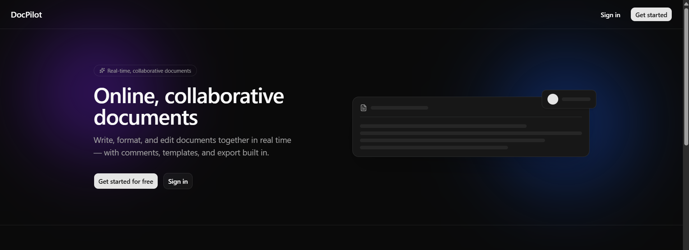
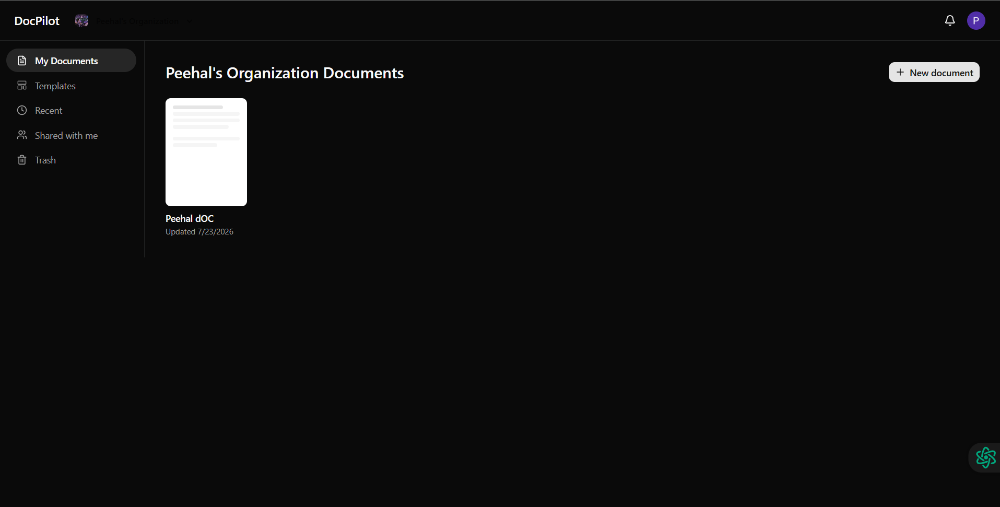
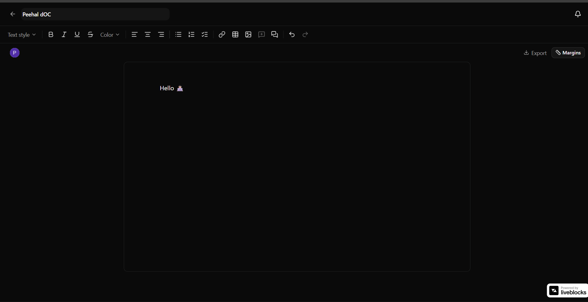

# 🚀 DocPilot

A real-time, collaborative document editor — a Google Docs clone built end-to-end as a portfolio project.

**🔗 Live demo:** [doc-pilot-five.vercel.app](https://doc-pilot-five.vercel.app)


Built with ❤️ by **Peehal**.

---

## 📸 Screenshots

**Landing page**


**Dashboard**


**Editor**


---

## ✨ Features

- 🔐 **Authentication & Organizations** — Google/email sign-in, multi-tenant workspaces, invites, and roles, all via Clerk
- 📝 **Rich text editor** — headings, lists, checklists, tables, links, images, text color/alignment, undo/redo
- 🤝 **Real-time collaboration** — live multi-cursor editing synced instantly across browsers via Liveblocks/Yjs
- 💬 **Comments & mentions** — highlight text to leave a comment, threaded replies, resolve, @mention teammates
- 🔔 **Notifications** — in-app bell with unread badge for mentions/comments
- 📑 **Templates** — start a document from Meeting Notes, a Resume, or a Project Proposal
- ⬇️ **Export** — download any document as PDF, HTML, plain text, or JSON
- 🗂️ **Document management** — My Documents, Recent, Shared with me, and a recoverable Trash (soft delete)
- 📱 **Responsive design** — usable from mobile to desktop

## 🛠️ Tech stack

**Client** — React (Vite) · Shadcn UI + Tailwind CSS · TanStack Query · Zustand · Tiptap · Liveblocks

**Server** — Node + Express · MongoDB (Mongoose) · Clerk (auth/orgs) · Cloudinary (images) · Puppeteer (PDF export)

**Architecture** — two separate repos (`gdocs-client`, `gdocs-server`) communicating over a REST API. Real-time editing runs on a *second* channel directly between the client and Liveblocks — Express only issues the room token, editing traffic never passes through it.

```
Browser (React)
  │  HTTPS  → gdocs-server (Express) → MongoDB Atlas   (docs, comments, notifications, templates)
  │  WSS    → Liveblocks cloud                          (live editing + cursors)
  │  Auth   → Clerk                                     (login, sessions, orgs, invites)
  │  Images → Cloudinary                                (signed uploads via Express)
```


## 📂 Folder structure

```
GoogleDOCs/
├── 🖥️ gdocs-client/                 # React (Vite) frontend
│   ├── 🌐 public/                   # Static assets served as-is
│   └── 📦 src/
│       ├── 🧩 components/
│       │   ├── ui/                  # Shadcn primitives (Button, Card, Dialog…)
│       │   ├── editor/              # Tiptap editor, toolbar, comments, export menu
│       │   ├── layout/              # Navbar, Sidebar, DocHeader, ProtectedRoute
│       │   ├── documents/           # Shared document-grid used by every doc list page
│       │   ├── notifications/       # NotificationBell dropdown
│       │   └── shared/              # EmptyState, Loader, ConfirmDialog, TemplateThumbnail
│       ├── 🪝 hooks/                 # TanStack Query hooks (useDocuments, useComments…)
│       ├── 📚 lib/                   # api.js (axios), collaboration.js (Liveblocks), tiptap.js, export.js
│       ├── 🗺️ routes/                # React Router route definitions
│       ├── 📄 pages/                 # Dashboard, DocumentEditor, Templates, Trash, Landing…
│       ├── 🧠 store/                 # Zustand UI state
│       └── 🎨 styles/                # Global CSS
│
├── ⚙️ gdocs-server/                  # Express REST API
│   └── 📦 src/
│       ├── ⚡ config/                 # DB connection, env validation, Cloudinary, template seeder
│       ├── 🗄️ models/                # Mongoose schemas (User, Document, Comment, Notification, Template)
│       ├── 🧩 modules/               # Feature-based: routes + controller + service per feature
│       │   ├── documents/           # CRUD, soft-delete/restore, scopes (mine/shared/trash)
│       │   ├── comments/            # Threaded comments + mentions
│       │   ├── notifications/       # In-app notifications
│       │   ├── templates/           # Starter templates
│       │   ├── uploads/             # Signed Cloudinary uploads
│       │   ├── liveblocks/          # Real-time room auth
│       │   ├── export/              # PDF/HTML/TXT/JSON export
│       │   └── webhooks/            # Clerk user-sync webhook
│       ├── 🛡️ middleware/            # requireAuth, requireDocAccess, errorHandler, validate
│       ├── 🧰 utils/                 # asyncHandler, export transforms (toHtml/toText/toPdf)
│       └── 🚏 routes/                # Mounts every module under /api
│
└── 📸 screenshots/                  # Images embedded above in this README
```

## ☁️ Deployment

- **Client** → deployed on [Vercel](https://vercel.com)
- **Server** → deployed on [Render](https://render.com)

